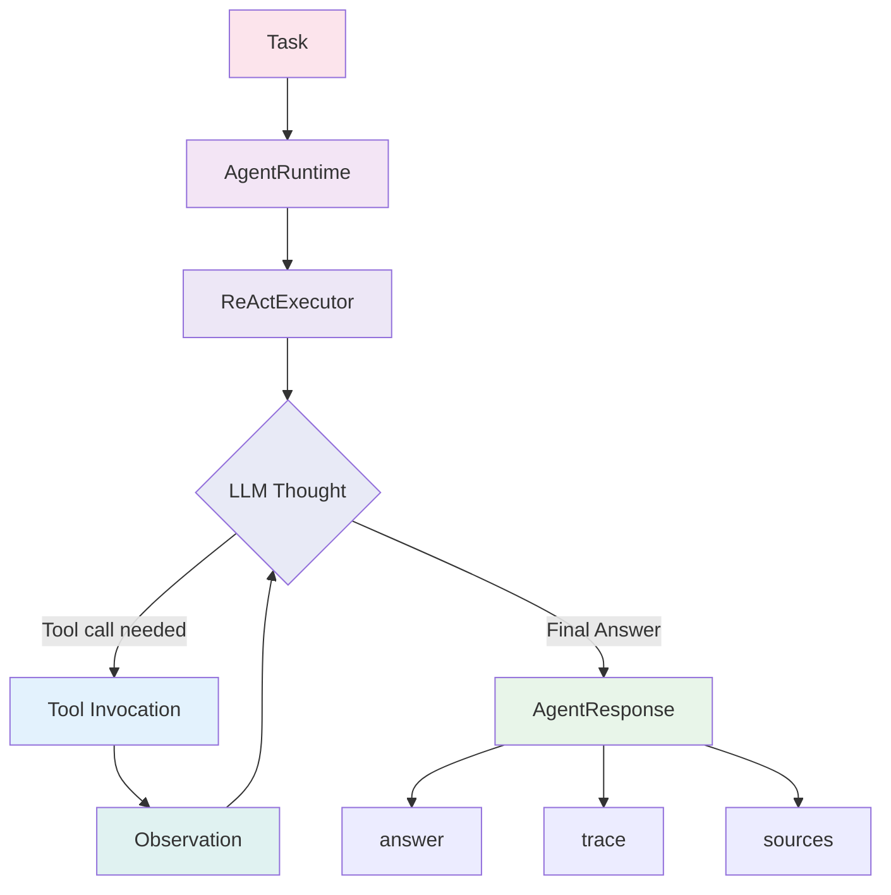
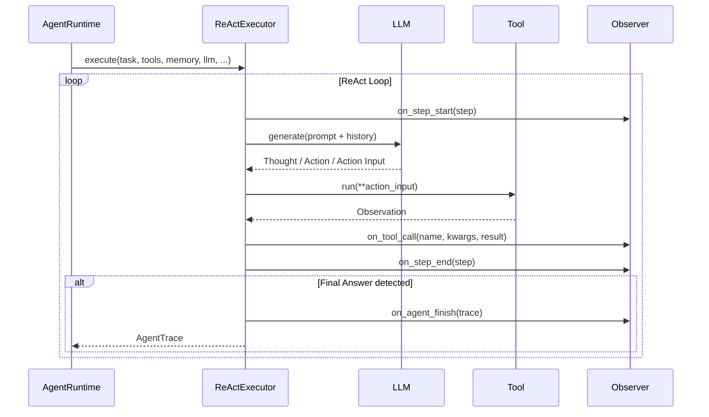
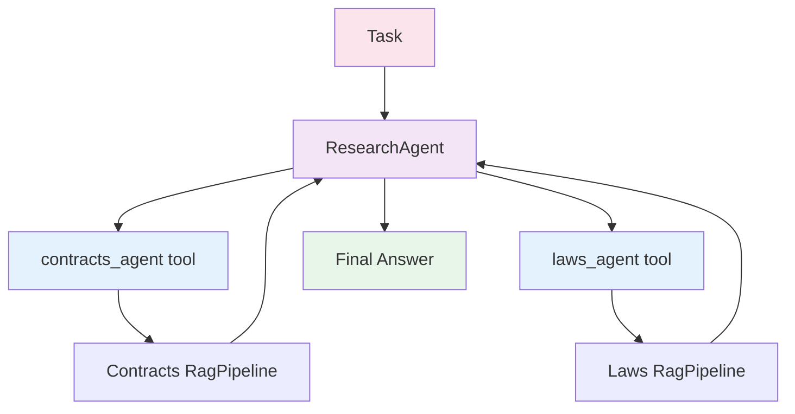
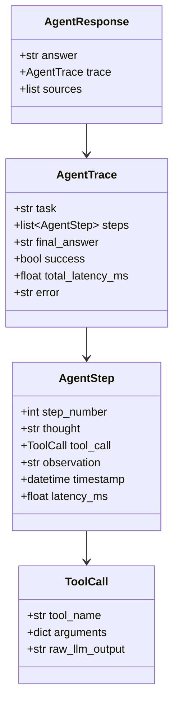

# Agents Guide

!!! abstract "v0.4.0 — Agentic Reasoning System"
    Multi-step reasoning with ReAct execution loop, pluggable tool system, memory management, and four built-in agents. Zero new mandatory dependencies — pure Python stdlib.

## Overview

The Quaerium agents framework lets you build intelligent, multi-step agents that reason through tasks, invoke tools, and produce grounded answers. The execution engine is based on the **ReAct** pattern (Reason + Act), first introduced by Yao et al. (2022).



Each iteration of the loop produces one `AgentStep`. The executor keeps looping until it detects a `Final Answer:` prefix or reaches `max_steps`.

---

## Key Concepts

<div class="grid cards" markdown>

-   :material-tools: **Tool**

    ---

    A callable capability exposed to the LLM. Implements the `Tool` protocol: `name`, `description`, `parameters_schema`, `run(**kwargs)`, and `arun(**kwargs)`. Created via `@tool` decorator or `ToolDefinition`.

    ```python
    from quaerium.agents import tool

    @tool(description="Returns today's date")
    def get_date() -> str:
        from datetime import date
        return date.today().isoformat()
    ```

-   :material-memory: **AgentMemory**

    ---

    Conversation memory abstraction. The default `InMemoryConversationMemory` keeps the last N turns. `VectorLongTermMemory` enables semantic recall across sessions.

    ```python
    from quaerium.agents.memory import InMemoryConversationMemory
    mem = InMemoryConversationMemory(max_turns=20)
    mem.add_message("user", "hello")
    ```

-   :material-eye-outline: **AgentObserver**

    ---

    Non-invasive hook system. Attach observers to receive callbacks on every step start/end, every tool call, and on agent finish — without modifying core logic.

    ```python
    class MyObserver:
        def on_step_end(self, step):
            print(f"[{step.step_number}] {step.latency_ms:.0f}ms")
    ```

-   :material-strategy: **ExecutionStrategy**

    ---

    Swappable execution loop. The default `ReActExecutor` implements the standard Thought/Action/Observation cycle. Implement your own to use different prompting strategies (chain-of-thought, tree-of-thought, etc.).

    ```python
    class MyStrategy:
        def execute(self, *, task, tools,
                    memory, llm, observers, max_steps):
            ...
    ```

</div>

---

## Tool System

Tools are the primary way agents interact with the world. Quaerium provides three ways to define tools.

=== "@tool decorator"

    The simplest approach. The decorator inspects your function's type hints to generate the JSON Schema automatically.

    ```python title="tools/date_tool.py" linenums="1"
    from quaerium.agents import tool

    @tool(description="Returns today's ISO 8601 date")  # (1)!
    def get_date() -> str:
        from datetime import date
        return date.today().isoformat()

    @tool(description="Add two integers and return the sum")
    def add_numbers(a: int, b: int) -> int:
        return a + b

    @tool(description="Search documents by keyword")
    def search_docs(query: str, top_k: int = 5) -> str:
        # Your search implementation
        results = my_search_engine(query, top_k)
        return "\n".join(results)
    ```

    1. The decorator reads the return type and all parameter annotations to build a JSON Schema compatible with OpenAI's function-calling spec.

    !!! tip "Schema inference"
        The `@tool` decorator uses `inspect.signature()` to extract parameter names, types, and defaults. All standard Python scalar types (`str`, `int`, `float`, `bool`, `list`, `dict`) are supported.

=== "ToolDefinition"

    Use `ToolDefinition` when you need explicit schema control, retry logic, or a fallback string for when the tool fails.

    ```python title="tools/search_tool.py" linenums="1"
    from quaerium.agents.tool import ToolDefinition

    def my_web_search(query: str) -> str:
        # Actual search implementation
        ...

    search_tool = ToolDefinition(
        name="web_search",
        description="Search the web for current information",
        fn=my_web_search,
        parameters_schema={  # (1)!
            "type": "object",
            "properties": {
                "query": {
                    "type": "string",
                    "description": "The search query"
                }
            },
            "required": ["query"],
        },
        max_retries=3,  # (2)!
        fallback="Web search is currently unavailable.",  # (3)!
    )
    ```

    1. Full JSON Schema definition for maximum control over parameter validation.
    2. The executor will retry up to 3 times on `Exception` before using the fallback.
    3. Returned to the agent as the observation if all retries fail, preventing hard crashes.

=== "ToolRegistry"

    `ToolRegistry` collects tools and generates prompt blocks for injection into the system prompt.

    ```python title="tools/registry.py" linenums="1"
    from quaerium.agents.tool import ToolRegistry
    from quaerium.agents import tool

    @tool(description="Returns today's ISO date")
    def get_date() -> str:
        from datetime import date
        return date.today().isoformat()

    @tool(description="Multiply two numbers")
    def multiply(a: float, b: float) -> float:
        return a * b

    # Build registry
    registry = ToolRegistry()
    registry.register(get_date)
    registry.register(multiply)

    # Generate prompt block for the LLM
    print(registry.to_prompt_block())
    # Output:
    # Available tools:
    # - get_date: Returns today's ISO date
    #   Parameters: {}
    # - multiply: Multiply two numbers
    #   Parameters: {"a": "float", "b": "float"}
    ```

### Tool Protocol

All tools must satisfy the `Tool` protocol (decorated with `@runtime_checkable`):

```python
from typing import Protocol, runtime_checkable, Any

@runtime_checkable
class Tool(Protocol):
    name: str
    description: str
    parameters_schema: dict[str, Any]

    def run(self, **kwargs: Any) -> str: ...
    async def arun(self, **kwargs: Any) -> str: ...
```

!!! note "Duck typing"
    Because `Tool` is `@runtime_checkable`, you can use `isinstance(obj, Tool)` at runtime to verify compliance without any inheritance.

---

## Memory

Memory gives agents context across turns and sessions.

### InMemoryConversationMemory

The default memory implementation. Uses a sliding window to keep the last N turns in RAM.

```python title="memory_example.py" linenums="1"
from quaerium.agents.memory import InMemoryConversationMemory

mem = InMemoryConversationMemory(max_turns=20)  # (1)!

# Add messages
mem.add_message("user", "What is the capital of France?")
mem.add_message("assistant", "The capital of France is Paris.")
mem.add_message("user", "And its population?")

# Retrieve full history
history = mem.get_history()
# Returns: [
#   {"role": "user", "content": "What is the capital..."},
#   {"role": "assistant", "content": "The capital..."},
#   {"role": "user", "content": "And its population?"},
# ]

# Reset (e.g. new session)
mem.clear()
```

1. When the memory exceeds `max_turns` entries, the oldest entries are dropped. This prevents unbounded token growth.

### VectorLongTermMemory

Long-term semantic memory backed by `VectorStoreClient` and `EmbeddingClient`. Ideal for agents that need to recall relevant context from past sessions.

```python title="long_term_memory.py" linenums="1"
from quaerium.agents.memory import VectorLongTermMemory
from quaerium.infra import get_ollama_embedding
from quaerium.infra.vectorstores import get_qdrant_service

embedding = get_ollama_embedding(model="nomic-embed-text")
vector_store = get_qdrant_service(
    host="localhost",
    port=6333,
    collection_name="agent_memory",
)

mem = VectorLongTermMemory(
    vector_store=vector_store,
    embedding_client=embedding,
    top_k=5,  # Retrieve 5 most relevant past turns
)
```

### AgentMemory Protocol

```python
from typing import Protocol, runtime_checkable

@runtime_checkable
class AgentMemory(Protocol):
    def add_message(self, role: str, content: str) -> None: ...
    def get_history(self) -> list[dict[str, str]]: ...
    def clear(self) -> None: ...
```

---

## ReActExecutor

The `ReActExecutor` is the default `ExecutionStrategy`. It drives the standard ReAct loop by composing a system prompt from the tool registry, appending conversation history, and parsing the LLM's output at each step.



### ReAct Format

The executor expects the LLM to produce output in this exact format:

```
Thought: I need to find today's date to answer the question.
Action: get_date
Action Input: {}
Observation: 2026-03-16
...
Final Answer: Today is 2026-03-16.
```

!!! info "Parsing"
    The executor uses two `re.DOTALL` regexes to parse `Action` and `Action Input` blocks. If JSON parsing of `Action Input` fails, it falls back to `{"query": raw_input}`. This means the parser is robust against imperfect LLM formatting.

---

## AgentRuntime

`AgentRuntime` is the central orchestrator. It wires together the LLM, tools, memory, execution strategy, and observers.

```python title="runtime_example.py" linenums="1"
from quaerium.agents import AgentRuntime
from quaerium.agents import tool
from quaerium.agents.memory import InMemoryConversationMemory
from quaerium.infra import get_ollama_llm

llm = get_ollama_llm(model="llama3.2")

@tool(description="Returns today's ISO date")
def get_date() -> str:
    from datetime import date
    return date.today().isoformat()

runtime = AgentRuntime(
    llm=llm,
    tools=[get_date],  # (1)!
    memory=InMemoryConversationMemory(max_turns=20),  # (2)!
    max_steps=10,  # (3)!
)

response = runtime.run("What day is it today?")

print(response.answer)
# Output: Today is 2026-03-16.

# Inspect the execution trace
for step in response.trace.steps:
    print(f"[Step {step.step_number}] Thought: {step.thought}")
    if step.tool_call:
        print(f"  Action: {step.tool_call.tool_name}")
        print(f"  Observation: {step.observation}")

print(f"Total latency: {response.trace.total_latency_ms:.0f}ms")
print(f"Success: {response.trace.success}")
```

1. Pass a list of tools — either `@tool`-decorated functions or `ToolDefinition` instances.
2. If `memory` is `None`, the runtime creates a default `InMemoryConversationMemory(max_turns=20)`.
3. The loop hard-stops at `max_steps` even if no `Final Answer` was produced, preventing infinite loops.

### AgentRuntime Constructor

| Parameter | Type | Default | Description |
|-----------|------|---------|-------------|
| `llm` | `LLMClient` | required | Language model for reasoning |
| `tools` | `list[Tool]` | `[]` | Tools available to the agent |
| `memory` | `AgentMemory \| None` | `None` | Conversation memory (defaults to `InMemoryConversationMemory`) |
| `strategy` | `ExecutionStrategy \| None` | `None` | Execution strategy (defaults to `ReActExecutor`) |
| `observers` | `list[AgentObserver]` | `[]` | Observer hooks |
| `max_steps` | `int` | `10` | Maximum reasoning steps before forced stop |

---

## Built-in Agents

Quaerium ships four production-ready agents that wrap core framework services as tools.

<div class="grid cards" markdown>

-   :material-magnify: **RAGAgent**

    ---

    Wraps a `RagPipeline` as a `rag_search` tool. Returns structured citations alongside the answer.

    Best for: document Q&A, knowledge-base chatbots, contract review.

-   :material-file-import: **IngestionAgent**

    ---

    Wraps `IngestionService` with three tools: `parse_document`, `list_formats`, and `check_status`.

    Best for: automated ingestion pipelines, document analysis, format inspection.

-   :material-chart-bar: **EvaluationAgent**

    ---

    Wraps `RetrievalEvaluator` and `GenerationEvaluator` as tools for autonomous quality assessment.

    Best for: CI/CD quality gates, periodic evaluation jobs, retrieval debugging.

-   :material-magnify-expand: **ResearchAgent**

    ---

    Composes multiple sub-agents (e.g. other `RAGAgent` instances) as tools for multi-hop reasoning across disparate knowledge bases.

    Best for: cross-domain research, multi-corpus Q&A, contract + law cross-referencing.

</div>

### RAGAgent

```python title="rag_agent_example.py" linenums="1"
from quaerium.agents import RAGAgent
from quaerium.agents import tool
from quaerium.agents.memory import InMemoryConversationMemory
from quaerium.infra import get_ollama_llm
from quaerium.infra.vectorstores import get_qdrant_service

llm = get_ollama_llm(model="llama3.2")
pipeline = ...  # Your configured RagPipeline

@tool(description="Returns today's ISO date")
def get_date() -> str:
    from datetime import date
    return date.today().isoformat()

agent = RAGAgent(
    llm=llm,
    rag_pipeline=pipeline,
    extra_tools=[get_date],  # (1)!
    memory=InMemoryConversationMemory(max_turns=20),
    max_steps=8,
)

response = agent.run("Quali sono le scadenze della sezione 4?")

print(response.answer)

# Access source citations
for source in response.sources:
    print(source.section_path)
```

1. Extra tools are appended to the built-in `rag_search` tool. This lets you augment the agent with dynamic capabilities (dates, calculators, external APIs) while keeping RAG as the primary knowledge source.

!!! tip "Source citations"
    `RAGAgent` extracts `section_path` metadata from retrieved chunks and surfaces them in `response.sources`. This makes it straightforward to build citation-aware UIs.

### IngestionAgent

```python title="ingestion_agent_example.py" linenums="1"
from quaerium.agents import IngestionAgent
from quaerium.infra import get_ollama_llm

llm = get_ollama_llm(model="llama3.2")
ingestion_service = ...  # Your configured IngestionService

ingest_agent = IngestionAgent(
    llm=llm,
    ingestion_service=ingestion_service,
    max_steps=6,
)

response = ingest_agent.run(
    "Analizza il documento /data/contract.pdf e dimmi quante pagine ha"
)
print(response.answer)
```

Built-in tools exposed by `IngestionAgent`:

| Tool | Description |
|------|-------------|
| `parse_document` | Parse and extract text from a file path |
| `list_formats` | List all supported ingestion formats |
| `check_status` | Check the ingestion status of a document |

### EvaluationAgent

```python title="eval_agent_example.py" linenums="1"
from quaerium.agents import EvaluationAgent
from quaerium.infra import get_ollama_llm

llm = get_ollama_llm(model="llama3.2")

eval_agent = EvaluationAgent(
    llm=llm,
    retrieval_evaluator=retrieval_eval,  # StandardRetrievalEvaluator
    generation_evaluator=generation_eval,  # StandardGenerationEvaluator
    max_steps=10,
)

response = eval_agent.run(
    "Evalua la qualità del retrieval per la query 'RAG'"
)
print(response.answer)
```

!!! note "Evaluator composition"
    `EvaluationAgent` accepts any object satisfying the `RetrievalEvaluator` or `GenerationEvaluator` protocols. Both parameters are optional — pass only what you need.

### ResearchAgent

`ResearchAgent` enables multi-hop reasoning by composing sub-agents as first-class tools. Each sub-agent's `run()` method is wrapped and exposed with a descriptive label.

```python title="research_agent_example.py" linenums="1"
from quaerium.agents import ResearchAgent, RAGAgent
from quaerium.infra import get_ollama_llm

llm = get_ollama_llm(model="llama3.2")

# Build specialized sub-agents
contracts_agent = RAGAgent(
    llm=llm,
    rag_pipeline=contracts_pipeline,
    max_steps=5,
)

laws_agent = RAGAgent(
    llm=llm,
    rag_pipeline=laws_pipeline,
    max_steps=5,
)

# Compose them into a researcher
researcher = ResearchAgent(
    llm=llm,
    sub_agents={
        "contracts_agent": contracts_agent,  # (1)!
        "laws_agent": laws_agent,
    },
    max_steps=12,
)

response = researcher.run(
    "Analizza i requisiti legali e contrattuali per la gara X"
)
print(response.answer)
```

1. The dict key becomes the tool name. Choose descriptive names so the LLM can correctly decide which sub-agent to invoke at each step.



---

## AgentObserver Pattern

Observers provide a non-invasive way to hook into agent execution without modifying core logic. Attach any number of observers to `AgentRuntime` via the `observers` parameter.

### Observer Protocol

```python
from typing import Protocol, runtime_checkable

@runtime_checkable
class AgentObserver(Protocol):
    def on_step_start(self, step: AgentStep) -> None: ...
    def on_step_end(self, step: AgentStep) -> None: ...
    def on_tool_call(
        self, tool_name: str, kwargs: dict, result: str
    ) -> None: ...
    def on_agent_finish(self, trace: AgentTrace) -> None: ...
```

### Building a Custom Observer

```python title="observers/logging_observer.py" linenums="1"
import logging
from quaerium.agents.models import AgentStep, AgentTrace

logger = logging.getLogger(__name__)

class LoggingObserver:
    """Logs every step and tool call at INFO level."""

    def on_step_start(self, step: AgentStep) -> None:
        logger.info(f"[Step {step.step_number}] Starting...")

    def on_step_end(self, step: AgentStep) -> None:
        logger.info(
            f"[Step {step.step_number}] Done in {step.latency_ms:.0f}ms"
        )

    def on_tool_call(
        self, tool_name: str, kwargs: dict, result: str
    ) -> None:
        logger.info(
            f"  Tool: {tool_name}({kwargs}) -> {result[:80]}"
        )

    def on_agent_finish(self, trace: AgentTrace) -> None:
        logger.info(
            f"Agent finished in {trace.total_latency_ms:.0f}ms "
            f"({len(trace.steps)} steps, success={trace.success})"
        )
```

Attach it at runtime construction:

```python title="runtime_with_observer.py" linenums="1"
from quaerium.agents import AgentRuntime
from quaerium.infra import get_ollama_llm

runtime = AgentRuntime(
    llm=get_ollama_llm(model="llama3.2"),
    observers=[LoggingObserver()],
)

response = runtime.run("What is 7 multiplied by 6?")
```

!!! tip "Multiple observers"
    You can attach as many observers as needed. A good production setup includes a `LoggingObserver`, a `MetricsObserver` (e.g. Prometheus counters), and an `AlertObserver` that fires on failures.

---

## Data Models

All agent data is represented by frozen dataclasses for safety and serialisability.



### ToolCall

```python
@dataclass(frozen=True)
class ToolCall:
    tool_name: str        # Name of the invoked tool
    arguments: dict       # Parsed JSON arguments
    raw_llm_output: str   # Raw text before parsing
```

### AgentStep

```python
@dataclass
class AgentStep:
    step_number: int          # 1-based index
    thought: str              # LLM's reasoning text
    tool_call: ToolCall | None  # None for Final Answer steps
    observation: str | None   # Tool result or None
    timestamp: datetime       # When this step started
    latency_ms: float         # Wall-clock time for this step
```

### AgentTrace

```python
@dataclass
class AgentTrace:
    task: str                    # Original task string
    steps: list[AgentStep]       # All steps in order
    final_answer: str | None     # Extracted final answer
    success: bool                # True if Final Answer was reached
    total_latency_ms: float      # Sum of all step latencies
    error: str | None            # Error message if success=False
```

### AgentResponse

```python
@dataclass
class AgentResponse:
    answer: str             # Final answer text (convenience accessor)
    trace: AgentTrace       # Full execution trace
    sources: list           # Citations (populated by RAGAgent)
```

---

## Best Practices

!!! tip "Keep tools small and focused"
    Each tool should do exactly one thing. Avoid combining multiple operations in a single tool. This makes it easier for the LLM to select the right tool and produce correct `Action Input`.

!!! tip "Write descriptive tool descriptions"
    The description is the only hint the LLM has about when and how to use the tool. Include what it does, what it returns, and any important constraints (e.g. "Returns at most 5 results").

!!! tip "Set appropriate max_steps"
    Simple Q&A agents rarely need more than 5 steps. Research agents with multiple sub-agents may need 10–15. Setting `max_steps` too high wastes tokens; setting it too low causes truncated answers.

!!! tip "Always use memory for multi-turn conversations"
    Without memory, every `runtime.run()` call is stateless. Pass an `InMemoryConversationMemory` instance to maintain conversation context across turns.

!!! tip "Use observers in production"
    Attach a logging observer and a metrics observer to every production agent. This gives you visibility into step counts, latency distribution, and tool call frequencies without modifying agent code.

!!! success "Reuse sub-agents"
    `ResearchAgent` lets you reuse existing `RAGAgent` instances. Build a library of specialized agents for different document collections and compose them dynamically based on the query.

!!! warning "Long-running tools and timeouts"
    Tools that call external APIs or run heavy computation can block the event loop. Wrap them with a timeout and return a fallback string. Use `ToolDefinition(max_retries=..., fallback=...)` to handle failures gracefully.

---

## Troubleshooting

!!! warning "Agent always reaches max_steps"
    **Symptom:** `response.trace.success` is `False` and `len(response.trace.steps) == max_steps`.

    **Causes and fixes:**

    - The LLM is not generating `Final Answer:` — check if your model supports instruction following. Try a larger or instruction-tuned model.
    - The tool descriptions are ambiguous — rewrite them to be more specific.
    - `max_steps` is too low for the task complexity — increase it.
    - The task is ambiguous — add more context or examples in the task string.

!!! warning "Tool call JSON parsing fails"
    **Symptom:** Steps show `Action Input: {"query": "<raw input>"}` when you expect structured arguments.

    **Cause:** The LLM did not produce valid JSON in the `Action Input:` block.

    **Fix:** Add a concrete example of the expected format to the tool description:
    ```python
    @tool(description='Search docs. Example: Action Input: {"query": "RAG", "top_k": 3}')
    def search_docs(query: str, top_k: int = 5) -> str: ...
    ```

!!! danger "Memory is always empty after restart"
    `InMemoryConversationMemory` is in-process and non-persistent. If you need persistence across process restarts, use `VectorLongTermMemory` backed by a durable vector store (Qdrant, Milvus, ChromaDB).

!!! danger "ResearchAgent sub-agents run in sequence"
    Sub-agents are invoked synchronously within the ReAct loop. If your sub-agents are slow, the total latency compounds. For parallel execution, implement a custom `ExecutionStrategy` that fans out to sub-agents concurrently using `asyncio.gather`.

!!! warning "Empty sources list from RAGAgent"
    **Symptom:** `response.sources` is an empty list.

    **Cause:** The agent's final answer did not go through the `rag_search` tool (it answered from memory or LLM knowledge).

    **Fix:** Rephrase the task to explicitly require retrieval, or check the trace to see which tools were actually called.

---

## See Also

- [Agents API Reference](../api/agents/index.md) — Complete class and protocol documentation
- [Agents Examples](../examples/agents.md) — Runnable code for common patterns
- [RAG Pipeline Guide](rag_pipeline.md) — Building pipelines to pass to `RAGAgent`
- [Evaluation Guide](evaluation.md) — Using `EvaluationAgent` for quality assessment
