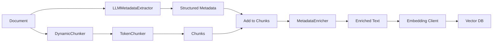

# Metadata Extraction & Enrichment

!!! success "New in v0.2.0"
    LLM-based metadata extraction and chunk enrichment for improved retrieval quality.

## Overview

**Metadata extraction** uses Large Language Models to extract structured information from unstructured text (e.g., extracting case numbers, dates, parties from legal documents). **Metadata enrichment** adds this extracted metadata inline to chunk text, making it searchable in both vector and keyword retrieval.

### Key Benefits

- 🎯 **Domain-Agnostic**: Works with legal, medical, tender, academic, or any custom domain
- 🔍 **Better Retrieval**: Metadata in text improves both vector similarity and keyword matching
- 🚀 **Batch Optimized**: Efficient batch processing for large-scale indexing
- 🛡️ **Type Safe**: Full protocol compliance with comprehensive type hints
- ✅ **Production Ready**: Error handling, logging, and graceful degradation

## When to Use

Use metadata extraction and enrichment when:

- **Documents contain structured information** buried in unstructured text
- **Domain-specific entities** need to be searchable (case numbers, product codes, etc.)
- **Filtering by metadata** during retrieval is important
- **Hybrid search** combining vector similarity and metadata filters is desired

### Use Cases

| Domain | Extractable Metadata | Example |
|--------|---------------------|---------|
| **Legal** | Case number, court, filing date, parties | `2024-CV-12345`, `Superior Court` |
| **Medical** | Patient ID, diagnosis codes, procedure dates | `P-123456`, `ICD-10: Z13.1` |
| **Tender** | Contracting authority, CIG code, deadline | `CIG-123456`, `2024-12-31` |
| **Academic** | Authors, institutions, publication date | `Smith et al.`, `MIT`, `2024` |
| **E-commerce** | Product ID, category, price, brand | `SKU-789`, `Electronics`, `$299` |

## Architecture



## Quick Start

### 1. Basic Extraction

```python
from quaerium.core.metadata import LLMMetadataExtractor
from quaerium.infra.llm import OllamaLLMClient

# Define domain-specific prompts
SYSTEM_PROMPT = """
You are a legal document analyzer. Extract metadata in JSON:
{"case_number": "", "court": "", "filing_date": "", "parties": []}
"""

EXTRACTION_PROMPT = """
From this document:
{context}

Extract: case number, court name, filing date, party names.
Return ONLY valid JSON.
"""

# Initialize extractor
llm = OllamaLLMClient(model="phi3:mini")
extractor = LLMMetadataExtractor(
    llm_client=llm,
    system_prompt=SYSTEM_PROMPT,
    extraction_prompt_template=EXTRACTION_PROMPT,
)

# Extract metadata
document_text = load_document("contract.pdf")
metadata = extractor.extract(document_text)

print(metadata)
# {'case_number': '2024-CV-12345', 'court': 'Superior Court', ...}
```

### 2. Enrich Chunks

```python
from quaerium.core.chunking import MetadataEnricher, TokenChunker

# Create chunks (simplified)
chunker = TokenChunker(max_tokens=512)
chunks = chunker.chunk(structured_chunks)

# Add metadata to all chunks
for chunk in chunks:
    chunk.metadata.update(metadata)

# Enrich text with metadata
enricher = MetadataEnricher()
enriched_texts = enricher.enrich_chunks(chunks)

print(enriched_texts[0])
# "Contract terms... [case_number: 2024-CV-12345] [court: Superior Court]"
```

### 3. Batch Embed

```python
from quaerium.infra.embedding import OllamaEmbeddingClient

# Embed enriched text
embed_client = OllamaEmbeddingClient()
embeddings = embed_client.embed_batch(enriched_texts)

# Store in vector DB
for chunk, embedding in zip(chunks, embeddings):
    vector_db.index(chunk, embedding)
```

## Domain-Specific Examples

### Legal Documents

```python
LEGAL_SYSTEM_PROMPT = """
Extract legal metadata in JSON:
{
  "case_number": "",
  "court": "",
  "filing_date": "",
  "parties": {"plaintiff": "", "defendant": ""},
  "document_type": ""
}
"""

LEGAL_EXTRACTION_PROMPT = """
Document:
{context}

Extract case information. Return JSON only.
"""

extractor = LLMMetadataExtractor(
    llm_client=llm,
    system_prompt=LEGAL_SYSTEM_PROMPT,
    extraction_prompt_template=LEGAL_EXTRACTION_PROMPT,
)
```

### Medical Records

```python
MEDICAL_SYSTEM_PROMPT = """
Extract medical metadata in JSON:
{
  "patient_id": "",
  "visit_date": "",
  "diagnosis_codes": [],
  "procedures": [],
  "physician": ""
}
"""

extractor = LLMMetadataExtractor(llm, MEDICAL_SYSTEM_PROMPT, ...)
```

### Tender Documents

```python
TENDER_SYSTEM_PROMPT = """
Extract tender metadata in JSON:
{
  "contracting_authority": "",
  "cig_code": "",
  "submission_deadline": "",
  "estimated_value": ""
}
"""

extractor = LLMMetadataExtractor(llm, TENDER_SYSTEM_PROMPT, ...)
```

## Advanced Configuration

### Custom Response Parser

If your LLM outputs non-JSON formats:

```python
def custom_parser(response: str) -> dict:
    """Parse KEY=value format."""
    metadata = {}
    for line in response.split("\n"):
        if "=" in line:
            key, value = line.split("=", 1)
            metadata[key.strip()] = value.strip()
    return metadata

extractor = LLMMetadataExtractor(
    llm_client=llm,
    system_prompt=system_prompt,
    extraction_prompt_template=template,
    response_parser=custom_parser,
)
```

### Custom Enrichment Format

```python
# Default format: [key: value]
enricher = MetadataEnricher()

# Custom format: (key=value)
enricher = MetadataEnricher(
    format_template="({key}={value})",
    separator=" | ",
)

# Custom excluded keys
enricher = MetadataEnricher(
    excluded_keys=["internal_id", "temp_field"],
)
```

### Batch Processing Optimization

```python
from concurrent.futures import ThreadPoolExecutor

# Extract metadata from multiple documents in parallel
def extract_metadata(doc_text):
    return extractor.extract(doc_text)

with ThreadPoolExecutor(max_workers=4) as executor:
    metadata_list = list(executor.map(extract_metadata, documents))

# Batch embed for efficiency
all_enriched = []
for chunks, meta in zip(chunk_groups, metadata_list):
    for chunk in chunks:
        chunk.metadata.update(meta)
    all_enriched.extend(enricher.enrich_chunks(chunks))

# Single batch embedding call
embeddings = embed_client.embed_batch(all_enriched)
```

## Best Practices

### 1. Prompt Engineering

!!! tip "Effective Prompts"
    - **Be specific** about the output format
    - **Provide examples** in the system prompt
    - **Request JSON only** to avoid parsing issues
    - **Use temperature=0** for deterministic extraction

```python
GOOD_SYSTEM_PROMPT = """
You extract contract metadata. Return ONLY this JSON:
{"contract_id": "string", "effective_date": "YYYY-MM-DD", "parties": ["string"]}

Example:
{"contract_id": "C-2024-001", "effective_date": "2024-01-15", "parties": ["Acme Corp", "Beta Inc"]}
"""

BAD_SYSTEM_PROMPT = """
Extract contract information and format it nicely.
"""
```

### 2. Error Handling

```python
metadata = extractor.extract(document_text)

# Always check for empty results
if not metadata:
    logger.warning(f"No metadata extracted from document {doc_id}")
    # Use default metadata or skip enrichment
    metadata = {"document_id": doc_id, "extraction_failed": True}

# Validate critical fields
required_fields = ["case_number", "court"]
if not all(metadata.get(field) for field in required_fields):
    logger.error(f"Missing required fields: {required_fields}")
```

### 3. Performance Optimization

```python
# Truncate long documents
extractor = LLMMetadataExtractor(
    llm_client=llm,
    system_prompt=system_prompt,
    extraction_prompt_template=template,
    max_text_length=8000,  # First 8k chars only
)

# Batch embedding (much faster)
embeddings = embed_client.embed_batch(enriched_texts)  # ✅ Good

# vs sequential (slow)
embeddings = [embed_client.embed(text) for text in enriched_texts]  # ❌ Slow
```

### 4. Testing

```python
# Test extraction with sample documents
def test_extraction():
    sample_doc = "Case No. 2024-CV-12345..."
    metadata = extractor.extract(sample_doc)
    
    assert "case_number" in metadata
    assert metadata["case_number"] == "2024-CV-12345"
    
# Test enrichment
def test_enrichment():
    chunk = MockChunk(text="Contract terms...", metadata={"id": "C-001"})
    enriched = enricher.enrich_text(chunk.text, chunk.metadata)
    
    assert "[id: C-001]" in enriched
```

## Troubleshooting

### Common Issues

??? question "Extractor returns empty dict"
    **Cause**: LLM failed to generate valid JSON or parsing failed.
    
    **Solution**:
    ```python
    # Check LLM response manually
    response = llm.generate(prompt, system_prompt=system_prompt)
    print(f"Raw LLM response: {response}")
    
    # Adjust prompts or use custom parser
    ```

??? question "Metadata not appearing in enriched text"
    **Cause**: Metadata keys are in the excluded list.
    
    **Solution**:
    ```python
    # Check excluded keys
    print(enricher.excluded_keys)
    # {'file_name', 'chunk_id', 'id', 'source_chunk_id'}
    
    # Use custom excluded keys
    enricher = MetadataEnricher(excluded_keys=["temp_field"])
    ```

??? question "Slow extraction"
    **Cause**: Processing full documents without truncation.
    
    **Solution**:
    ```python
    # Set max_text_length
    extractor = LLMMetadataExtractor(..., max_text_length=5000)
    
    # Or extract from summary/first page only
    summary = document_text[:5000]
    metadata = extractor.extract(summary)
    ```

## Next Steps

- 📚 **[API Reference](../api/core/metadata.md)**: Detailed API documentation
- 💡 **[Examples](../examples/metadata_extraction.md)**: Full working examples
- 🔧 **[Chunking Guide](./chunking.md)**: Learn about chunking strategies
- 🚀 **[RAG Pipeline](./rag_pipeline.md)**: Integrate into RAG workflow

## See Also

- [Chunking Strategies](./chunking.md)
- [Embeddings](./embeddings.md)
- [Vector Stores](./vector_stores.md)
- [RAG Pipeline Guide](./rag_pipeline.md)
